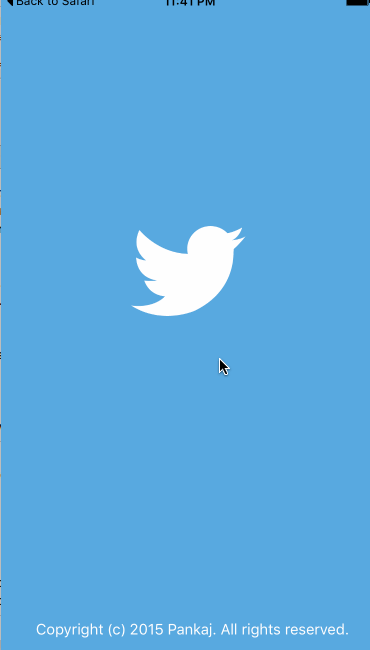

# ios-twitter

This is a basic twitter app to read and compose tweets using the [Twitter API](https://apps.twitter.com/).

Time spent: `<18 hours>`

### Features

#### Required

- [x] Dragging anywhere in the view should reveal the menu.
- [x] The menu should include links to your profile, the home timeline, and the mentions view.
- [x] The menu can look similar to the LinkedIn menu below or feel free to take liberty with the UI.
- [x] Profile view contains the user header view.
- [x] Profile view contains a section with the users basic stats: # tweets, # following, # followers
- [x] Tapping on a user image on the home timeline should bring up that user's profile page.

#### Optional

- [ ] Implement the paging view for the user description on the profile page.
- [ ] As the profile paging view moves, increase the opacity of the background screen. See the actual Twitter app for this effect.
- [ ] Pulling down the profile page should blur and resize the header image.
- [ ] Long press on tab bar to bring up Account view with animation.
- [ ] Tap account to switch to.
- [ ] Include a plus button to Add an Account.
- [ ] Swipe to delete an account.

### Walkthrough

